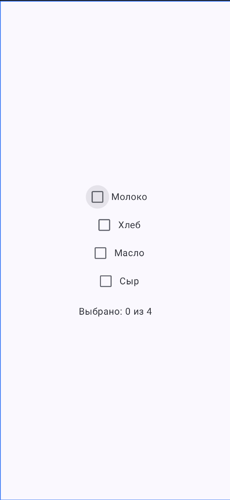
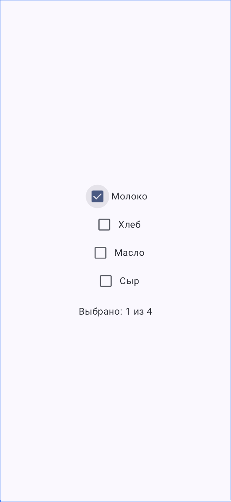
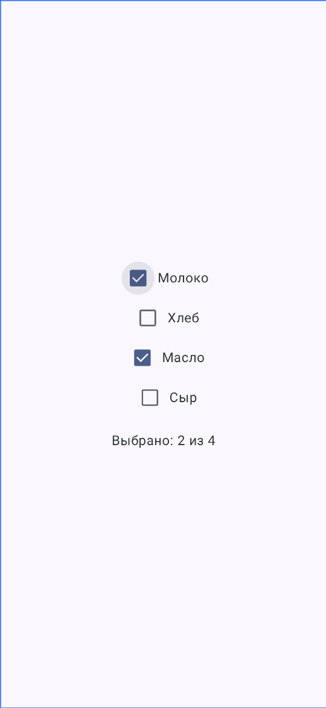
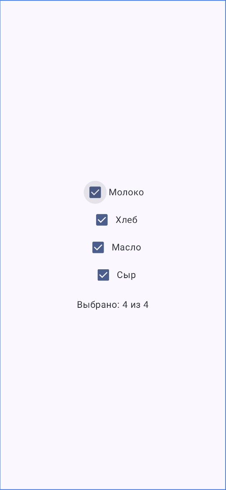

<h1>экзамен по мдк01.03</h1>
<p>
<h2>Гарсаян Арсен ИП-235</h2>
<p>
<h2>Вариант №6 "Флажки"</h2>
<p>
<h3>Создайте список из 4 чекбоксов (Checkbox) с подписями: «Молоко», «Хлеб», «Масло», «Сыр». Внизу экрана — текст «Выбрано: X из 4», где X динамически обновляется при изменении состояния чекбоксов.</h3>
<p>
</img>
</img>
</img>
</img>
<p>

```Kotlin
package com.example.exz_06ip235

import android.os.Bundle
import androidx.activity.ComponentActivity
import androidx.activity.compose.setContent
import androidx.activity.enableEdgeToEdge
import androidx.compose.foundation.layout.Arrangement
import androidx.compose.foundation.layout.Column
import androidx.compose.foundation.layout.Row
import androidx.compose.foundation.layout.fillMaxSize
import androidx.compose.foundation.layout.padding
import androidx.compose.material3.Checkbox
import androidx.compose.material3.Scaffold
import androidx.compose.material3.Surface
import androidx.compose.material3.Text
import androidx.compose.runtime.Composable
import androidx.compose.runtime.mutableStateListOf
import androidx.compose.runtime.remember
import androidx.compose.ui.Alignment
import androidx.compose.ui.Modifier
import androidx.compose.ui.tooling.preview.Preview
import androidx.compose.ui.unit.dp
import com.example.exz_06ip235.ui.theme.Exz_06ip235Theme

class MainActivity : ComponentActivity() {
    override fun onCreate(savedInstanceState: Bundle?) {
        super.onCreate(savedInstanceState)
        enableEdgeToEdge()
        setContent {
            Exz_06ip235Theme {
                Scaffold(modifier = Modifier.fillMaxSize()) { innerPadding ->
                    CheckboxList(
                        modifier = Modifier.padding(innerPadding)
                    )
                }
            }
        }
    }
}

@Preview(showBackground = true)
@Composable
fun CheckboxListPreview() {
    Exz_06ip235Theme {
        Surface {
            CheckboxList()
        }
    }
}

@Composable
fun CheckboxList(modifier: Modifier = Modifier) {
    val items = listOf("Молоко", "Хлеб", "Масло", "Сыр")
    val checkedStates = remember { mutableStateListOf(false, false, false, false) }
    val selectedCount = checkedStates.count { it }

    Column(
        modifier = modifier
            .fillMaxSize()
            .padding(16.dp),
        verticalArrangement = Arrangement.Center,
        horizontalAlignment = Alignment.CenterHorizontally
    ) {
        items.forEachIndexed { index, item ->
            Row(
                verticalAlignment = Alignment.CenterVertically
            ) {
                Checkbox(
                    checked = checkedStates[index],
                    onCheckedChange = { checkedStates[index] = it }
                )
                Text(text = item)
            }
        }

        Text(
            text = "Выбрано: $selectedCount из ${items.size}",
            modifier = Modifier.padding(top = 16.dp)
        )
    }
}
```